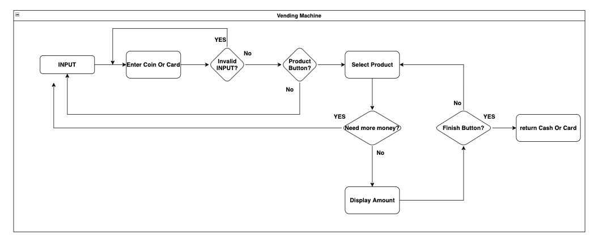
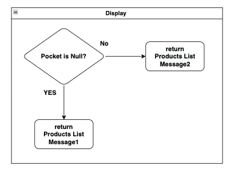
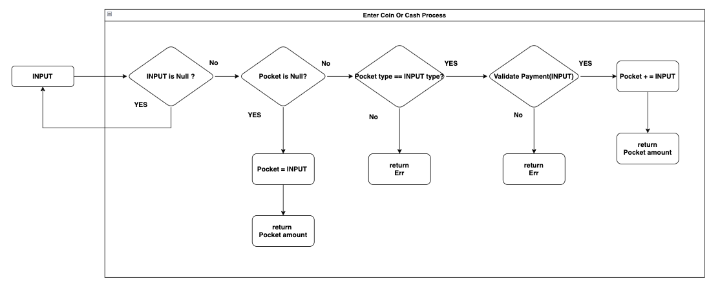
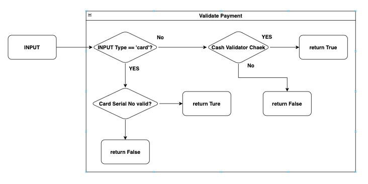
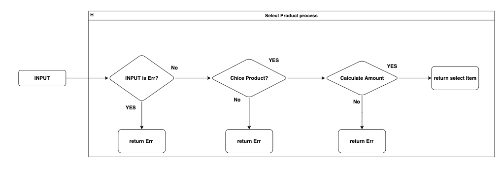
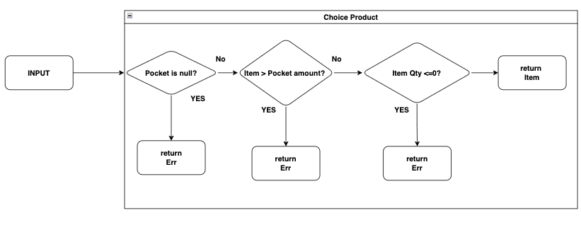
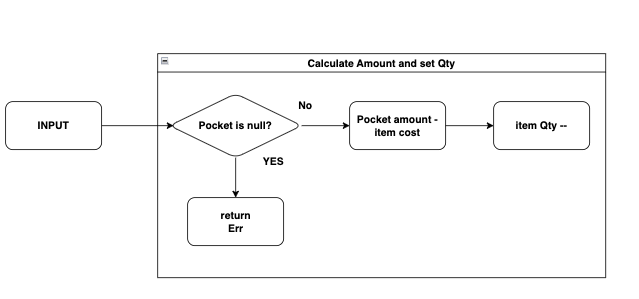
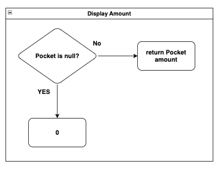
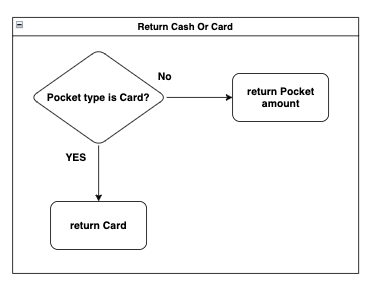

## Mini Toy Project - Vending Machine

- Simple 3-tier architecture Project

## Requirement

- The **vending machine** display **items**, **price** and **quantity**
- The **vending machine** ask the user to enter **cash or insert a card**
  and the cash accepted are 100, 500, 1,000, 5,000, 10,000
- The user can enter **cash** multiple times
- The user can select **items** multiple times
- The vending machine calculates total money inserted
- The vending machine display the **change amount** to the user
- The vending machine calculate the change amount
- The vending machine return the change amount or the card inserted
- The vending machine provide the item selected with the user
- Multiple vending machine administrators can be registered
- A single administrator can manage multiple items
- There is only one administrator per item

---

## DB schema

peoducts : administrator = N : 1

---

## Diagram

### 1. Total Flow Chart

---

### 2. Display Products

### 3. Enter Cash Or Card

### 3-1 Validate Payment

### 4. Select Product

### 4-1 Choice Product

### 4-2 Calculate Amount Qty

### Display Amount

### Return Cash or Card

